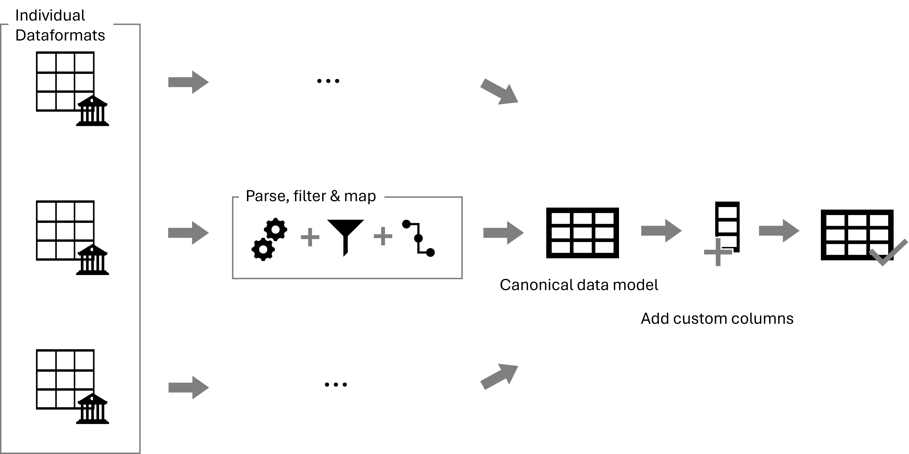

# Bank Data Normalizer

Welcome to my **data integration and transformation script for financial analysis**! This project is a personal endeavor to streamline and consolidate financial data from various bank statements, enabling insightful analysis of spending habits and financial trends.

## 🚀 Project Overview

In this project, I developed a Python script that:

1. **Ingests** CSV files in varying formats containing bank statements.
2. **Transforms** the data into a unified format for consistency.
3. **Concatenates** the transformed data into a single dataset.
4. **Enriches** the dataset with custom columns such as:
   - Categorization of transactions (e.g., expense vs. income).
   - Identification of transaction types (e.g., groceries, utilities, entertainment).



This project was driven by my passion for understanding my own financial habits and creating a clean, structured dataset for further analysis.

## 🧠 Key Learning Outcomes

Through this project, I honed my skills in:

- **Data Integration**: Handling diverse data formats and ensuring consistency across datasets.
- **Data Transformation**: Writing reusable and efficient functions for data preprocessing.
- **Custom Logic Implementation**: Applying domain-specific rules to enrich data for analysis.
- **Code Structure and Modularity**: Designing a script that is both maintainable and extensible.

## ⚙️ Usage

1. **Customization**
    - adjust the [`static_inputs`](./src/static_input.py) to your personal situation (especially the categories and accounts)
    - create a `personal_information.py` file in `src`-folder where you input your personal information regarding account ids and mappings between cateogries and identifiying attributes
    ```
    MY_IBANS: dict[str, str] - a mapping of your personal account ids, used to identify internal transfers
    MY_RECURRING_EXPENSES_IBAN: dict[str, str] - a mapping to identify recurring expenses based on account id
    MY_RECURRING_INCOME_IBAN: dict[str, str] - a mapping to identify recurring income based on account id

    MY_CATEGORIES_IBAN: dict[str, list[str]] - a mapping between a cateogry from `static_inputs.py` and identifying account id
    MY_CATEGORY_BESCHREIBUNG: dict[str, list[str]] - a mapping between a cateogry from `static_inputs.py` and a string inside the `Beschreibung` field to identify it (e.g. charges on a credit card may not include an account id but have certain keywords in their transaction description, those keywords are search for and then based on that the category is applied)
    ```
2. **Model your statements** - inside the [`statement`](./src/statement/)-folder model your statement with a pandera model
    - add the `pandera` model
    - add a configuration-dictionary containing all individual parameters based of [`StatementConfig`](./src/config.py) class

3. **Add your statement to pipeline**

    - add the configuration-dictionary to the other statement configurations in the [`main`](./src/main.py)-method

4. **Add your inputs per execution**
    ```
    QUARTERLY_REPORT_YEAR = "2020"
    QUARTERLY_REPORT_QUARTER = "3"
    QUARTERLY_REPORT_ROOT_DIR_STR = ./your/path
    ```

5. **Execute**

    ```python -m src.main```

## 🔧 Features

- **Automated Parsing**: Reads multiple CSV files with varying schemas.
- **Flexible Transformation**: Adapts to differing column names and formats.
- **Custom Categorization**: Classifies transactions based on user-defined rules.
- **Unified Output**: Produces a clean, consolidated dataset ready for analysis.

## 🌟 Highlights

- **Personalized Use Case**: Tailored specifically for analyzing personal finances, but the methodology is adaptable to other domains.
- **End-to-End Pipeline**: From raw, unstructured data to a clean, analysis-ready dataset.
- **Focus on Data Quality**: Ensures output consistency through rigorous preprocessing.

## 🛠️ Tools and Technologies

- **Python**: The core language for implementation.
- **Pandas**: For powerful data manipulation and analysis.
- **Pandera**: For validating different stages of dataframes in the pipeline.
- **Git**: To version-control this project.

## 💡 Challenges Overcome

- Normalizing datasets with vastly different structures.
- Designing custom logic for transaction categorization in a way that is both comprehensive and adaptable.
- Ensuring robustness when dealing with edge cases, such as missing or malformed data.

## 📈 Results

The final dataset provides a detailed and unified view of my financial transactions, paving the way for advanced analysis such as:

- Identifying spending patterns.
- Monitoring income vs. expenses over time.
- Categorizing and visualizing data for actionable insights.

## 🌍 Future Improvements

- **Expand Input Formats**: Support for additional file types (e.g., Excel, JSON).
- **Easier adaptation for other use cases**: Lessen dependency on concrete data structures.
- **Visualization Tools**: Integrate with libraries like Matplotlib or Seaborn for graphical analysis.
